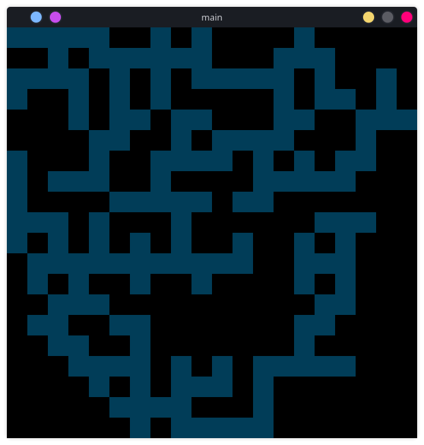
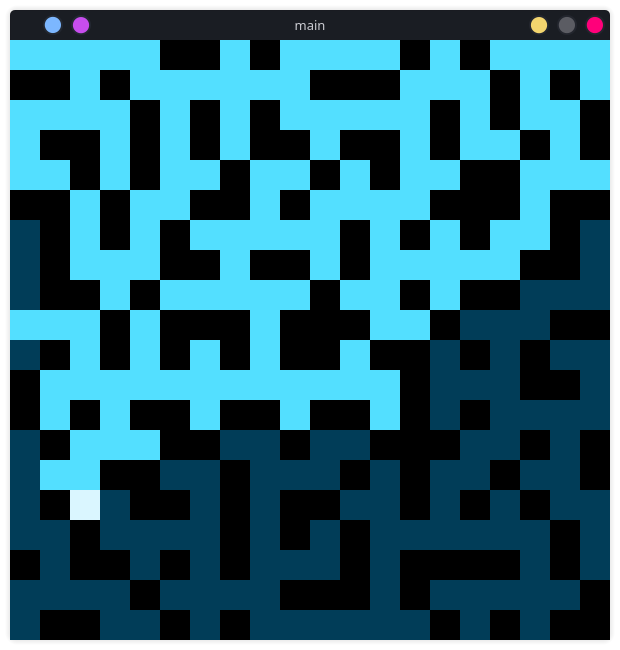

# BfsMaze
Simple maze generator and solver

---
### Images

---
### Controls
You can reload it with `R` key 

---

### Algorythms

**Generation**: Prim's algorithm (for every tile generate edges with random weight)

**Solution**: BFS (broad first search) - pull and process current cell from queue, push to queue neighbours of current

**golang**: it works on goroutines (logic and drawing are separated) and context objects (to have an opportunity to drop current logic process and restart it)